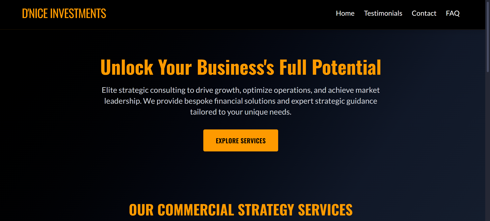
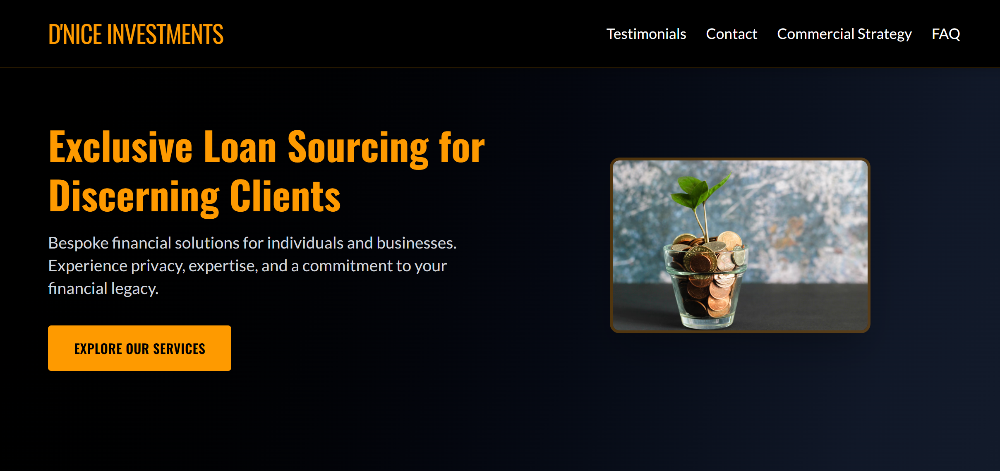

# Consultant Website

**The official website for D'nice Investments.**

This website provides a clean and professional online presence for D'nice Investments, showcasing their services, expertise, and contact information. Built with the latest web technologies, it focuses on performance, user experience, and ease of use.

## Features

*   Clean and professional design
*   Responsive layout (works on desktop, tablet, and mobile)
*   Built with Next.js for optimal performance and SEO
*   Easy to customize
*   Quick deployment options (e.g., Vercel)

## Technologies Used

*   [Next.js](https://nextjs.org/)
*   [React](https://reactjs.org/)
*   (Add other technologies like Tailwind CSS, TypeScript, etc., if applicable)

## Getting Started

First, run the development server:

```bash
npm run dev
# or
yarn dev
# or
pnpm dev
# or
bun dev
```

Open [http://localhost:3000](http://localhost:3000) with your browser to see the result.

You can start editing the page by modifying `app/page.js`. The page auto-updates as you edit the file.

This project uses [`next/font`](https://nextjs.org/docs/app/building-your-application/optimizing/fonts)


## Deployment

This project is deployed on [Firebase](https://firebase.google.com/).

You can view the live site here: [https://dnice-consultant-web.web.app/commercial-strategy/](https://dnice-consultant-web.web.app/commercial-strategy/)

## Screenshots

Here are some screenshots of the website:





